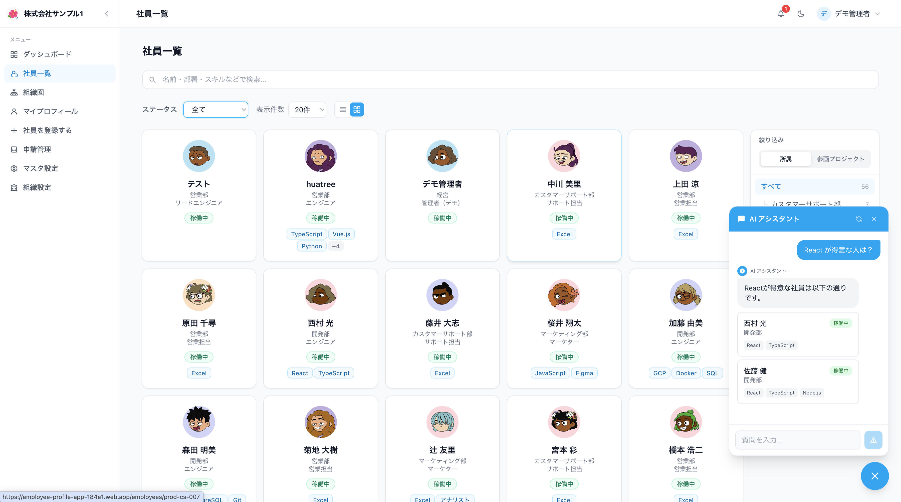
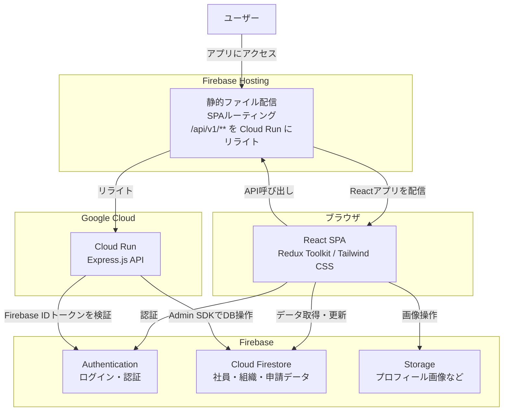

# Hitonabi — 社員プロフィール管理アプリ

社員のプロフィール・スキル・所属組織を一元管理するWebアプリケーションです。  
AIチャットによる社員検索や、組織図の可視化など、社内人材の把握を支援する機能を備えています。



---

## 主な機能

- **社員プロフィール管理** — 氏名・部署・役職・スキル・プロジェクト経験を登録・編集
- **組織図** — 部署・チームの階層構造をビジュアルで確認
- **AIチャット** — Geminiを活用した自然言語での社員検索
- **申請フロー** — スキル・職種・プロジェクトの追加申請と承認
- **ダッシュボード** — スキル分布・人員構成をグラフで可視化
- **認証** — Firebase Authenticationによるメール/パスワードログイン

---

## 技術スタック

| レイヤー | 技術 |
|---|---|
| フロントエンド | React 19 + TypeScript + Vite |
| 状態管理 | Redux Toolkit |
| スタイリング | Tailwind CSS v4 |
| フォーム | React Hook Form |
| チャート | Recharts |
| APIサーバー | Express.js (Node.js / TypeScript) |
| 認証 | Firebase Authentication |
| データベース | Cloud Firestore |
| ストレージ | Firebase Storage |
| ホスティング | Firebase Hosting |
| サーバー実行環境 | Cloud Run |
| AI | Gemini API (google/genai) |
| テスト | Vitest + Testing Library |

---

## システム構成図



### リクエストフロー

1. ブラウザが Firebase Hosting にアクセス
2. `/api/v1/**` へのリクエストは Cloud Run にリライト
3. Cloud Run の `authMiddleware` が Firebase Auth でIDトークンを検証
4. 検証後、`firebase-admin` 経由で Firestore にアクセス
5. SPA内の直接操作（Firestore / Storage）は Firebase SDK で行う

---

## ディレクトリ構成

```
.
├── src/
│   ├── features/          # 機能単位のモジュール
│   │   ├── auth/          # 認証
│   │   ├── employees/     # 社員プロフィール
│   │   ├── organizations/ # 組織管理
│   │   ├── dashboard/     # ダッシュボード
│   │   ├── aiChat/        # AIチャット
│   │   ├── requests/      # 申請フロー
│   │   └── settings/      # 設定
│   ├── pages/             # ページコンポーネント
│   └── app/               # Storeなどアプリ全体の設定
├── server/
│   └── src/
│       ├── routes/        # APIルート
│       ├── middleware/    # 認証ミドルウェアなど
│       └── scripts/       # シードスクリプト
├── firestore.rules        # Firestoreセキュリティルール
├── storage.rules          # Storageセキュリティルール
└── firebase.json          # Firebase設定
```

---

## 開発環境のセットアップ

### 前提条件

- Node.js 20+
- Firebase CLI (`npx firebase-tools@latest`)
- Firebase プロジェクト（開発用・本番用）
- サービスアカウントキー（`server/serviceAccountKey.dev.json`）

### 環境変数

| ファイル | 用途 |
|---|---|
| `.env.development.local` | フロントエンド（開発用Firebaseプロジェクト） |
| `.env.local` | フロントエンド（本番用Firebaseプロジェクト） |
| `server/.env.development` | サーバー（開発用） |
| `server/.env` | サーバー（本番用） |

`.env.example` を参考に各ファイルを作成してください。

### 起動手順

**1. 依存パッケージのインストール**

```bash
npm install
cd server && npm install
```

**2. Firebaseプロジェクトを開発用に切り替え**

```bash
npx firebase-tools@latest use development
```

**3. Storageエミュレーター起動**（ターミナル 1）

```bash
npx firebase-tools@latest emulators:start --only storage
```

> Emulator UI: http://127.0.0.1:4000/storage

**4. APIサーバー起動**（ターミナル 2）

```bash
npm run dev:server
```

**5. フロントエンド起動**（ターミナル 3）

```bash
npm run dev:front
```

> アクセス先: http://localhost:5173

または `npm run dev` で 4・5 をまとめて起動できます。

---

## テスト

```bash
# ユニットテスト
npm test

# カバレッジレポート
npm run test:coverage
```

---

## デプロイ

### フロントエンド（Firebase Hosting）

```bash
# 本番プロジェクトに切り替え
npx firebase-tools@latest use default

# ビルド
npm run build

# デプロイ
npx firebase-tools@latest deploy --only hosting
```

### Firestoreルール・インデックス

```bash
npx firebase-tools@latest deploy --only firestore
```

### Cloud Run（APIサーバー）

Cloud Runへのデプロイは Google Cloud Console またはCI/CD経由で行います。


gcloud run deploy employee-api \
    --source ./server \
    --region asia-northeast1 \
    --project employee-profile-app-184e1 \
    --set-env-vars ALLOWED_ORIGIN=https://employee-pr
  ofile-app-184e1.web.app,GEMINI_API_KEY=