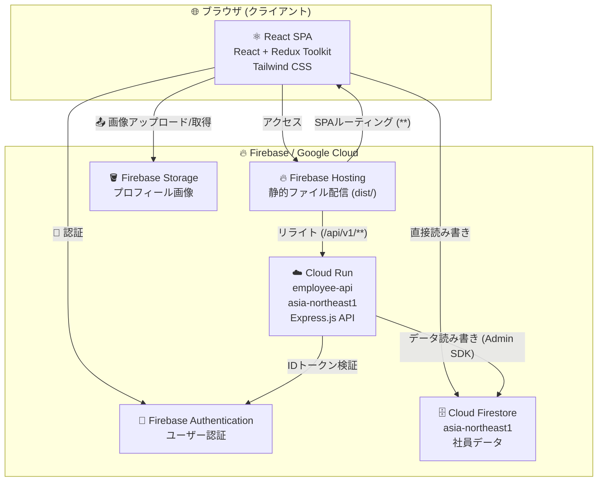

# Employee Profile App

社員プロフィール管理アプリケーション

## インフラ構成図



### 構成概要

| レイヤー | 技術 | 役割 |
|---|---|---|
| フロントエンド | React 19 + Vite + TypeScript | SPA、Redux Toolkit で状態管理 |
| ホスティング | Firebase Hosting | 静的ファイル配信、APIリライト |
| APIサーバー | Cloud Run (Express.js) | REST API (`/api/v1/employees`) |
| 認証 | Firebase Authentication | ユーザーログイン、IDトークン検証 |
| データベース | Cloud Firestore | 社員データ永続化 |
| ストレージ | Firebase Storage | プロフィール画像保存 |

### リクエストフロー

1. ブラウザが Firebase Hosting にアクセス
2. `/api/v1/**` へのリクエストは Cloud Run にリライト
3. Cloud Run の `authMiddleware` が Firebase Auth でIDトークンを検証
4. 検証後、`firebase-admin` 経由で Firestore にアクセス
5. SPA内の直接操作（Firestore/Storage）は Firebase SDK で行う

---

## 開発環境のセットアップ

### 利用技術

- **フロントエンド**: React 19 + TypeScript + Vite
- **ビルドツール**: Vite（HMR対応）
- **リンター**: ESLint + typescript-eslint

### React公式プラグイン

Viteでは以下の2つのプラグインが利用可能です。

- [@vitejs/plugin-react](https://github.com/vitejs/vite-plugin-react/blob/main/packages/plugin-react) — [Oxc](https://oxc.rs) を使用
- [@vitejs/plugin-react-swc](https://github.com/vitejs/vite-plugin-react/blob/main/packages/plugin-react-swc) — [SWC](https://swc.rs/) を使用

### React Compiler について

React Compiler はビルドパフォーマンスへの影響があるため、このテンプレートでは無効化されています。有効化する場合は[公式ドキュメント](https://react.dev/learn/react-compiler/installation)を参照してください。

## ESLint の設定拡張

本番アプリケーションを開発する場合、型情報を活用したリントルールを有効にすることを推奨します。

```js
export default defineConfig([
  globalIgnores(['dist']),
  {
    files: ['**/*.{ts,tsx}'],
    extends: [
      // その他の設定...

      // tseslint.configs.recommended を以下に置き換える
      tseslint.configs.recommendedTypeChecked,
      // より厳格なルールを使用する場合
      tseslint.configs.strictTypeChecked,
      // スタイル関連のルールを追加する場合
      tseslint.configs.stylisticTypeChecked,

      // その他の設定...
    ],
    languageOptions: {
      parserOptions: {
        project: ['./tsconfig.node.json', './tsconfig.app.json'],
        tsconfigRootDir: import.meta.dirname,
      },
      // その他のオプション...
    },
  },
])
```

React専用のリントルールとして [eslint-plugin-react-x](https://github.com/Rel1cx/eslint-react/tree/main/packages/plugins/eslint-plugin-react-x) と [eslint-plugin-react-dom](https://github.com/Rel1cx/eslint-react/tree/main/packages/plugins/eslint-plugin-react-dom) もインストールできます。

```js
// eslint.config.js
import reactX from 'eslint-plugin-react-x'
import reactDom from 'eslint-plugin-react-dom'

export default defineConfig([
  globalIgnores(['dist']),
  {
    files: ['**/*.{ts,tsx}'],
    extends: [
      // その他の設定...
      // Reactのリントルールを有効化
      reactX.configs['recommended-typescript'],
      // React DOMのリントルールを有効化
      reactDom.configs.recommended,
    ],
    languageOptions: {
      parserOptions: {
        project: ['./tsconfig.node.json', './tsconfig.app.json'],
        tsconfigRootDir: import.meta.dirname,
      },
      // その他のオプション...
    },
  },
])
```
