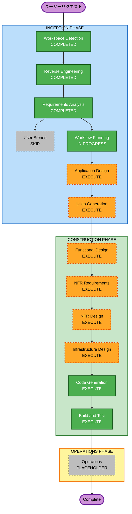

# 実行計画 (Execution Plan)

## 詳細分析サマリー

### 変換スコープ (Brownfield)
- **変換タイプ**: Architectural（スタブ完成 → Firebase統合 → OpenSearch追加の段階的アーキテクチャ変換）
- **主要変更**:
  - Phase 1: 未実装ページ（詳細・登録・編集・ダッシュボード）の実装
  - Phase 2: Firebase Auth + Firestore + Node.js API サーバー追加
  - Phase 3: OpenSearch 検索基盤追加
- **影響コンポーネント**:
  - src/pages/ (全ページコンポーネント)
  - src/features/employees/ (Repository, Slice 拡張)
  - src/app/store.ts (新 Slice 追加)
  - 新規: src/features/auth/, src/features/departments/, src/features/skills/

### 変更インパクト評価
- **ユーザー向け変更**: Yes — 全ページの実装、認証フロー、権限管理
- **構造変更**: Yes — 新フィーチャーモジュール追加、Node.js バックエンド新設
- **データモデル変更**: Yes — Department/Skill マスター追加、Employee に uid/role/timestamps 追加
- **API 変更**: Yes — employeeRepository の Firebase 差し替え、Node.js API 新設
- **NFR 影響**: Yes — セキュリティ（認証・認可）、パフォーマンス（OpenSearch）

### リスク評価
- **リスクレベル**: Medium-High
- **ロールバック複雑度**: Moderate（フェーズ分けで段階的に切り替え可能）
- **テスト複雑度**: Complex（PBT + セキュリティルール適用）

---

## ワークフロー可視化



### テキスト版（代替表示）

```
INCEPTION PHASE:
  [x] Workspace Detection  - COMPLETED
  [x] Reverse Engineering  - COMPLETED
  [x] Requirements Analysis - COMPLETED
  [ ] User Stories          - SKIP
  [>] Workflow Planning     - IN PROGRESS
  [ ] Application Design    - EXECUTE
  [ ] Units Generation      - EXECUTE

CONSTRUCTION PHASE (ユニットごとに繰り返し):
  [ ] Functional Design     - EXECUTE
  [ ] NFR Requirements      - EXECUTE
  [ ] NFR Design            - EXECUTE
  [ ] Infrastructure Design - EXECUTE
  [ ] Code Generation       - EXECUTE (ALWAYS)
  [ ] Build and Test        - EXECUTE (ALWAYS)

OPERATIONS PHASE:
  [ ] Operations            - PLACEHOLDER
```

---

## 実行するステージ

### INCEPTION PHASE

- [x] Workspace Detection — COMPLETED
- [x] Reverse Engineering — COMPLETED
- [x] Requirements Analysis — COMPLETED
- [ ] User Stories — **SKIP**
  - **根拠**: 要件定義で2つのロール（一般社員・管理者）が明確に定義済み。個人開発で外部ステークホルダーなし。ユーザーストーリーが追加する価値より要件ドキュメントで十分。
- [>] Workflow Planning — IN PROGRESS
- [ ] Application Design — **EXECUTE**
  - **根拠**: 新規コンポーネント多数（Detail, Create, Edit, Dashboard 実装）+ 新フィーチャーモジュール（auth, departments, skills）+ Node.js バックエンド設計が必要
- [ ] Units Generation — **EXECUTE**
  - **根拠**: 3フェーズ×複数コンポーネントの大規模変更。フェーズごとにユニット分割して管理する必要がある

### CONSTRUCTION PHASE

- [ ] Functional Design — **EXECUTE**
  - **根拠**: 新データモデル（Department, Skill, User）+ 複雑なビジネスロジック（役割ベースアクセス制御）+ 状態管理変更
- [ ] NFR Requirements — **EXECUTE**
  - **根拠**: セキュリティ（Firebase Auth, Firestore Security Rules）+ パフォーマンス（OpenSearch）+ Security/PBT 拡張ルールが Enabled
- [ ] NFR Design — **EXECUTE**
  - **根拠**: NFR Requirements が EXECUTE のため
- [ ] Infrastructure Design — **EXECUTE**
  - **根拠**: Firebase プロジェクト設定, Node.js サーバー設計, OpenSearch クラスター設計が必要
- [ ] Code Generation — **EXECUTE**（ALWAYS）
- [ ] Build and Test — **EXECUTE**（ALWAYS）

---

## ユニット構成（予定）

Units Generation ステージで詳細化しますが、以下3ユニットを想定:

| Unit | 名称                | 内容                                          |
|------|-------------------|----------------------------------------------|
| 1    | Frontend MVP      | 詳細・登録・編集・ダッシュボードページ実装         |
| 2    | Firebase統合       | Auth + Firestore + Node.js API + 権限管理      |
| 3    | OpenSearch統合     | 検索API + インデックス同期 + Storage            |

---

## 成功基準

- **主目標**: 3フェーズで人材管理アプリを本番品質で構築する
- **主要成果物**:
  - Phase 1: 全ページ実装済み・モックデータで CRUD 動作
  - Phase 2: Firebase 接続・Google 認証・権限管理動作
  - Phase 3: OpenSearch 検索動作・アバター画像アップロード
- **品質ゲート**:
  - Vitest ユニットテスト（PBT 含む）
  - Firebase Security Rules テスト
  - TypeScript 型エラーなし
  - ESLint エラーなし
